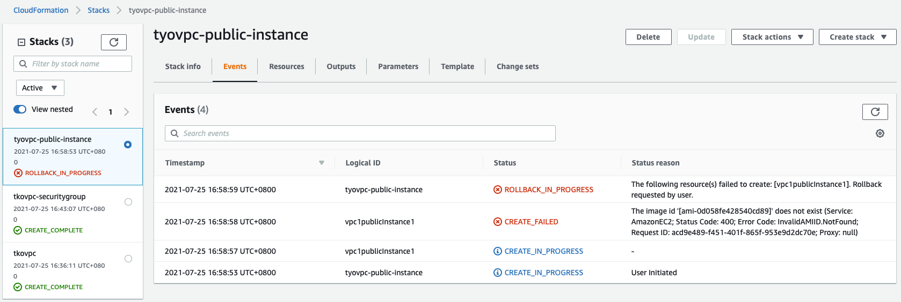

# aws-cloudfoundation-vpc-parameters

# Lab enviroment will be consist of 3 CFN templates: 
1. Create common VPC teamplate to deploy in mulitples region 
2. Create Security groups
3. Create Public instances

# Parameters 
```bash
ParameterKey='VPCCIDR',ParameterValue='192.168.0.0/16'
ParameterKey='PublicSubnet1CIDR',ParameterValue='192.168.1.0/24'
ParameterKey='PublicSubnet2CIDR',ParameterValue='192.168.2.0/24'
ParameterKey='PublicSubnet3CIDR',ParameterValue='192.168.3.0/24'
ParameterKey='RegionCode',ParameterValue='sgp'
ParameterKey='AZ1Code',ParameterValue='sgpaz1'
ParameterKey='AZ2Code',ParameterValue='sgpaz2'
ParameterKey='AZ3Code',ParameterValue='sgpaz3'
```

# IP Addresss assigments 
```
sgpvpc - 192.168.0.0/16
sydvpc - 172.16.0.0/16
tkovpc - 10.10.0.0/16
```

# Steps: 

## 1. Create common VPC teamplate and deploy in mulitples region (sg, syd, tokyo)
- [vpc.yaml](./vpc.yaml)

### i) `sgpvpc` for "ap-southeast-1" 

```bash
aws cloudformation create-stack --stack-name sgpvpc --template-body file://vpc.yaml --parameters ParameterKey='VPCCIDR',ParameterValue='192.168.0.0/16' ParameterKey='PublicSubnet1CIDR',ParameterValue='192.168.1.0/24' ParameterKey='PublicSubnet2CIDR',ParameterValue='192.168.2.0/24' ParameterKey='PublicSubnet3CIDR',ParameterValue='192.168.3.0/24' ParameterKey='RegionCode',ParameterValue='sgp' ParameterKey='AZ1Code',ParameterValue='sgpaz1' ParameterKey='AZ2Code',ParameterValue='sgpaz2' ParameterKey='AZ3Code',ParameterValue='sgpaz3' --region ap-southeast-1
```

### ii) `sydvpc` for "ap-southeast-2"

```bash
aws cloudformation create-stack --stack-name sydvpc --template-body file://vpc.yaml --parameters ParameterKey='VPCCIDR',ParameterValue='172.16.0.0/16' ParameterKey='PublicSubnet1CIDR',ParameterValue='172.16.1.0/24' ParameterKey='PublicSubnet2CIDR',ParameterValue='172.16.2.0/24' ParameterKey='PublicSubnet3CIDR',ParameterValue='172.16.3.0/24' ParameterKey='RegionCode',ParameterValue='syd' ParameterKey='AZ1Code',ParameterValue='sydaz1' ParameterKey='AZ2Code',ParameterValue='sydaz2' ParameterKey='AZ3Code',ParameterValue='sydaz3' --region ap-southeast-2
```

### iii) `tkovpc` for "ap-northeast-1"

```bash
aws cloudformation create-stack --stack-name tkovpc --template-body file://vpc.yaml --parameters ParameterKey='VPCCIDR',ParameterValue='10.10.0.0/16' ParameterKey='PublicSubnet1CIDR',ParameterValue='10.10.1.0/24' ParameterKey='PublicSubnet2CIDR',ParameterValue='10.10.2.0/24' ParameterKey='PublicSubnet3CIDR',ParameterValue='10.10.3.0/24' ParameterKey='RegionCode',ParameterValue='tko' ParameterKey='AZ1Code',ParameterValue='tkoaz1' ParameterKey='AZ2Code',ParameterValue='tkoaz2' ParameterKey='AZ3Code',ParameterValue='tkoaz3' --region ap-northeast-1
```
<br>

## 2. Create Securitygroup with CFN template "vpc-securitygroup.yaml"
- [vpc-securitygroup.yaml](./Templates/vpc-securitygroup.yaml)

### i) `sgpvpc` security for "ap-southeast-1" 
```bash
aws cloudformation create-stack --stack-name sgpvpc-securitygroup --template-body file://vpc-securitygroup.yaml --parameters ParameterKey='vpcStackName',ParameterValue='sgpvpc' --region ap-southeast-1
```

### ii) `sydvpc` security for "ap-southeast-2" 
```bash
aws cloudformation create-stack --stack-name sydvpc-securitygroup --template-body file://vpc-securitygroup.yaml --parameters ParameterKey='vpcStackName',ParameterValue='sydvpc' --region ap-southeast-2
```

### iii) `tkovpc` security for "ap-northeast-1" 
```bash
aws cloudformation create-stack --stack-name tkovpc-securitygroup --template-body file://vpc-securitygroup.yaml --parameters ParameterKey='vpcStackName',ParameterValue='tkovpc' --region ap-northeast-1
```

<br>
## 3. Create public instance with CFN template "vpc-public-instace.yaml"
- [vpc-public-instance.yaml](./Templates/public-instance.yaml)

### i) `sgpvpc` public instance for "ap-southeast-1" 

```bash
aws cloudformation create-stack --stack-name sgpvpc-public-instance --template-body file://vpc-public-instance.yaml --parameters ParameterKey='vpcsecurityGroupStackName',ParameterValue='sgpvpc-securitygroup' ParameterKey='vpcStackName',ParameterValue='sgpvpc' --region ap-southeast-1
```

### ii) `sydvpc` public instance for "ap-southeast-2" 

```bash
aws cloudformation create-stack --stack-name sydvpc-public-instance --template-body file://vpc-public-instance.yaml --parameters ParameterKey='vpcsecurityGroupStackName',ParameterValue='sydvpc-securitygroup' ParameterKey='vpcStackName',ParameterValue='sydvpc' --region ap-southeast-1
```

### iii) `tyovpc` public instance for "ap-northeast-1" 

You may need to change image-id that availble on your different region. 
```bash
aws cloudformation create-stack --stack-name tyovpc-public-instance --template-body file://vpc-public-instance.yaml --parameters ParameterKey='vpcsecurityGroupStackName',ParameterValue='tkovpc-securitygroup' ParameterKey='vpcStackName',ParameterValue='tkovpc' --region ap-northeast-1
```

